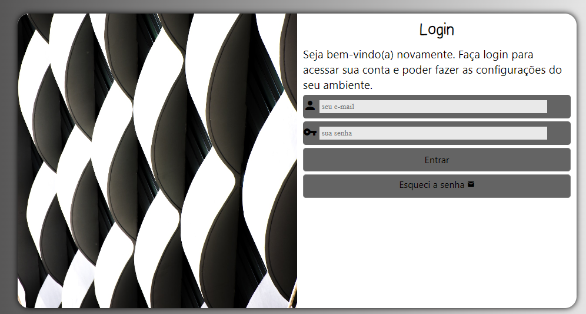

<h1>tela de login</h1>

este projeto foi feito no intuito de simular uma dela login para qualquer site

<h2>Tecnologias usadas neste site </h2>

 para a construção foi utilizada somente HTML5 e CSS3, muito provavelmente ele sofrera algum tipo de alteração futura esté foi meu primeiro site usando a modelo mobile frist então pode ser que acha algum tipo de em inconveniência em seu dispositivo por conta do tamanho de sua tela 

<h3> exemplo de como o projeto fica em uma tela de notebook</h3>

<h3>Link do projeto já hospedado</h3>

<a href="https://lucaskawatoko.github.io/tela-de-login/" target="_blank">https://lucaskawatoko.github.io/tela-de-login/</a>
